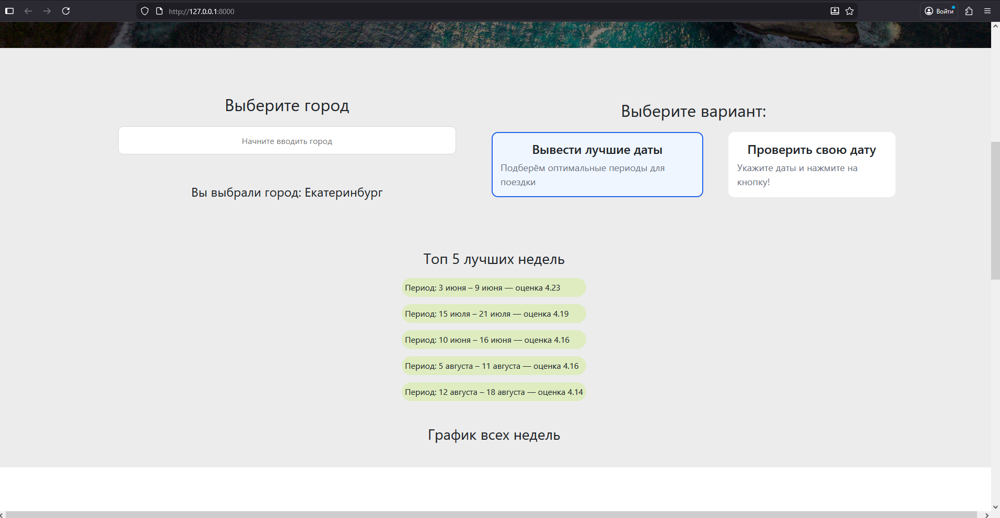
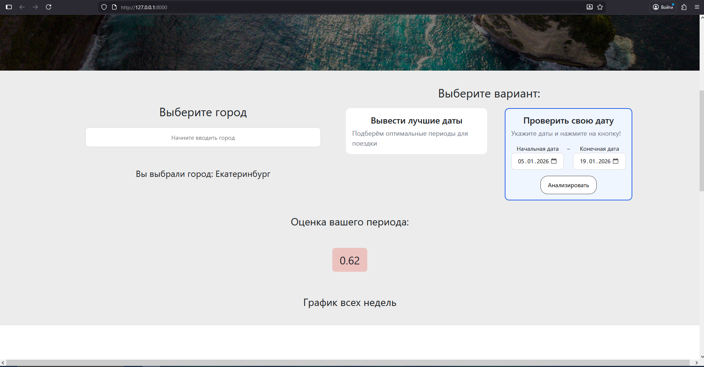
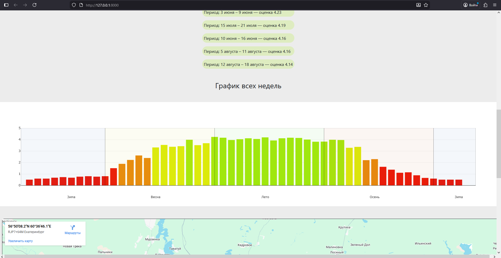
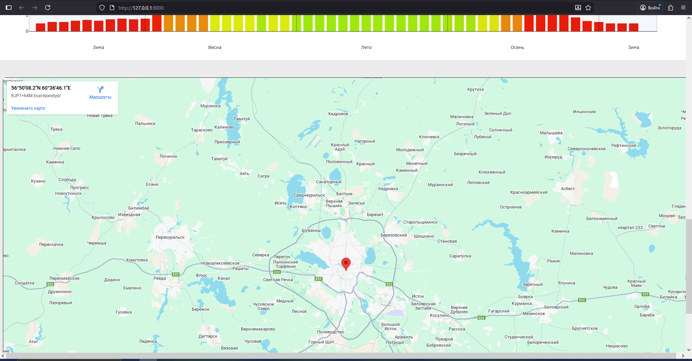

# Tourist_travel_time_helper

Веб-сервис для туристов, помогающий выбрать оптимальное время поездки в город с учётом погоды и туристической активности. Анализирует исторические данные и визуализирует лучший период для путешествия.

**Ссылка на рабочий проект:**  
https://Saaubili.pythonanywhere.com 

## Технологии
* Backend: Python 3.13, Django 6.0
* Database: SQLite
* Analytics: Pandas — агрегация данных и расчет очков для каждой недели
* Frontend: Plotly — визуализация оценки недель, Bootstrap 5 — верстка интерфейса

## Функциональность
* Подбор оптимального периода поездки для выбранного города
* Оценка пользовательского периода поездки по погодным условиям и туристической активности
* Визуализация оценки каждой недели в виде графика

## Скриншоты

*Главная страница сервиса с выбором города и режима аналитики*


*График оценки недель по погодным условиям и туристической активности*


*Результат оценки выбранного пользователем периода поездки*


*Граф с оценкой каждой недели в году*


*Google карта, меняющаяся в зависимости от выбранного города*

## Как запустить проект локально
1. ### **Клонируйте репозиторий:**
   ```bash
   git clone https://github.com/Saaubili/Tourist_travel_time_helper.git
   ```
2. ### **Создайте и активируйте виртуальное окружение:**
   ```bash
   python -m venv venv
   source venv/bin/activate  # для Linux/Mac
   venv\Scripts\activate     # для Windows
   ```
3. ### **Установите зависимости:**
   ```bash
   pip install -r requirements.txt
   ```
   
4. ### Настройка переменных окружения:

    Проект использует API для получения русских названий городов. Чтобы локально загрузить данные, нужно создать файл `.env` в корне проекта (В одной папке с manage.py) и добавить туда свой ключ.
    Ключом является username с сайта GeoNames (https://www.geonames.org/). Вам необходимо зарегистрироваться, далее во вкладке с настройками аккаунта 
    включить возможность пользоваться API
    ```bash
    # .env
    GEONAMES_USERNAME=ваш_ключ_от_GeoNames
    ```
5. ### Подготовка данных:
    Необходимо наполнить модели данными из датасетов. Для наполнения модели City воспользуйтесь командой load_cities_csv и предоставить путь к файлу worldcities.csv
    ```bash
   python manage.py load_cities_csv "DataSets/worldcities.csv"
    ```
   Для заполнения TourismStat необходимо воспользоваться командой load_tourism_info_from_dataset и указать путь к Net occupancy rate.tsv
    ```bash
   python manage.py load_tourism_info_from_dataset "DataSets/EU tourism data/Net occupancy rate.tsv"
    ```
6. ### **Запустите сервер:**
   ```bash
   python manage.py runserver
   ```
7. ### **Откройте проект в браузере:**
   Перейдите по ссылке: http://127.0.0.1:8000/